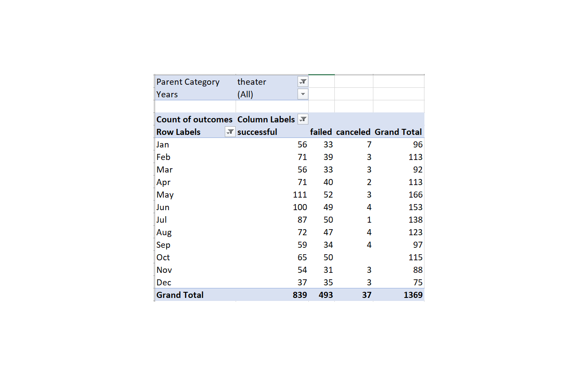

# Kickstarting with Excel
---

## Overview of Project
---
### Background
* The background of this analysis is fairly simple: To help Louise optimally execute the Kickstarter campaign for her play by identifying trends from relevant historical Kickstarter campaign data and drawing implications. However, the purpose of the specific analysis conducted for deliverables 1 and 2 of this module's challenge is twofold, as expressed in the next paragraph.
### Purpose
1. To observe any patterns/trends that presented themselves upon analyzing the total number of each campaign outcome (successful, failed, and canceled) that fell under the parent category 'theatre', while simultaneously observing the month each campaign outcome was launched.
  * Further, I would say the purpose of this particular analysis was to determine whether or not there was a signficant correlation between a theatre camapign outcome and one or more campaign launched dates classified by month.
2. To observe any patterns/trends that presented themselves upon analyzing the total percentage of campaign outcomes that fell under the subcategory 'plays', while categorizing the campaign outcomes by their pre-setout goals using an array of ranges to represent all of the data.
  * Putting all the data into different buckets provides a much clearer picture because we can then observe if any or all campaign goals are signifcantly correlated with any outcome, thereby   allowing us to determine if setting Louise's goal too high/low could be detrimental to achieving   a successful outcome.
---

## Analysis and Challenges
---
### Deliverable 1 Analysis:
1. I began this deliverable by adding a "Years" column to the existing main sheet (Kickstarter data) using the "Year()" function like so:
  * 
2. I then created a pivot table from the Kickstarter worksheet, and placed the pivot table in a new sheet. I also titled the Pivot table "Theatre Outcomes by Launch Date", and placed the appropriate pivot table fields in the columns, rows, values, and filters fields. Lastly, I used the Parent Category filter to filter the pivot table to include only the data that fell under the 'Theatre' parent category. After that, my pivot table looked like the following image:
  * 
3. Next, I created a pivot line chart from the pivot table to visualize the relationship between outcomes and campaign launch month:
  * 
---
### Deliverable 1 Challenges:
I encountered a few challenges whilst completing deliverable 1:
1. When I made the pivot table for this deliverable, I found that the 'rows' pivot field was suddenly populated with two other fields, which I did not intend for. Further, this was causing my pivot table rows to be based on the campaign launch date year rather than month. I was stuck for around 5 minutes, and then decided to simply drag the rows out into the excel sheet which I learned from Googling it, and sure enough, this solved the problem.
2. The other challenge I encountered occurred while I was trying to sort the campaign outcomes in descending order so the campaign outcome "successful" was first. I attempted to find a solution via Google but originally, I was unsuccessful. I ended up leaving it for a few days, writing the issue down, and circling back to it a few days later. I sat thinking about it for a bit and then I simply tried selecting the pivot table column like I would select a normal excel sheet column, and moved it like I would a normal excel sheet column. This worked perfectly and my problem was solved.
---
### Deliverable 2 Analysis:
1. I started this deliverable by creating a new sheet and naming it "Outcomes Based on Goals". Then, I created the columns listed out in the instructions to hold the data.
2. Then, I created the rows, (goal value ranges/bins) as per the instructions, to look like the following:
  * 
  * Note: I believe I found an error in how the last bucket/range is listed in the instructions because it says "Greater than 50000". Furthermore, the preceeding range is listed as "45000 to 49999". Therefore, if the next row were to be "Greater than 50000", it would not be accounting for any campaign goal set at exactly 50000. Hence, I changed my last range to correct this.
3. I used the 'COUNTIFS()' function to populate the "Number Successful", "Number Failed", and "Number Canceled" columns by filtering the Kickstarter "outcome" column, the "goal" amount column using the goal ranges, and on the "Subcategory" column using "plays" as the criteria. The formula I used is displayed in the image below:
  * 
4. Lastly, I populated the rest of the columns appropriately using the SUM formula.
---
### Deliverable 2 Challenges:
1. I had no challenges for deliverable 2. However, if I am brainstorming what challenges there could have been, I would say creating the correct COUNTIFS statement could have been challenging if I hadn't frequently used this specific function during my past Summer internship.
---
## Results
---

### Two Conclusions I Drew Based on the Theatre Outcomes by Launch Date Analysis:
1. The months of May and June clearly share a strong correlation with successful campaigns. Therefore, I would recommended Louise launch her campaign sometime in May or June.
2. It seems that the month of December would be the worst time for Louise to launch her camapaign because December possesses the highest percentage of failed outcomes.

### One Conclusion I Drew from the Outcomes Based on Goals Analysis:
1. One conclusion I would like to draw from this analysis revolves around the successful campaign percentage difference between two separate ranges. Specifically, campaigns with a goal of less than $1000, between $1000-$4999, and between $5000-$9999. Campaigns with a goal of less than $1000 had a success rate of 75.81%, while those with a goal between $1000-$4999 had a success rate of 72.61%. Moreover, the next bucket ($5000-$9999) had a success rate of 55.03%. Additionally, it is clear that Louise wants to raise more than $1000. Therefore, given the 17.58% drop in successful campaigns between the $1000-$4999 goal and the $5000-$9999 goal, I strongly recommend Louise remains in the $1000-$4999 campaign goal range.
---

### What are some limitations of this dataset?
* It is possible that the data is not accounting for other relevant variables that could alter the final results. For example, there is no data on what percentage of canceled campaigns were canceled because they ended up raising their funds in other ways.
* Also, there was no economic, societal, or other external factors that were evaluated in our analysis. For example, what if there was a decline in people going to plays in April of 2016 due to a series of violent protestors that chose to protest outside of an area with many theatres. Events like this could cause people to notice this and subsequently not donate to these types of campaigns during that specific time, which could skew the data.
* The data could not be paint an accurate picture of how people living in the area where Louise wants to conduct her play would react to her campaign. For example, since we don't have data on each campaign's city, (where they will be doing whatever they're doing) most of the theatre/plays data could have come from certain areas that strongly like or dislike plays. Meanwhile, the people from the city where Louise wants to put on her production may really want to invest in her play to make it excellent, in which case, a higher goal than $4-$4999 would be appropriate.

### What are some other possible tables and/or graphs that we could create?
* Some other possible tables and/or graphs that we could create include: 
1. A graph that groups the theatre/plays campaigns by their outcomes (successful, failed, canceled) and compares the length of time the campaign was active before reaching an outcome. 
  * I believe this could give Louise a better sense of how long it has historically taken for similar campaigns to reach their goals, thereby allowing Louise to possibly gauge how long she should wait before it would be time to maybe try something else to raise her desired capital.
2. A graph that combines the two variables already analyzed. This table/graph would potentially allow Louise to uncover which variable is potentially more important.
---
## Note
* I deleted the 'Descriptive Statistics' sheet from the Excel file copy I am uploading even though the instructions did not say to remove it because all of the cells were returning reference errors since their formulas were derived from the Successful / Failed sheets, which the instructions did say to remove, so it made no sense to keep it in.
